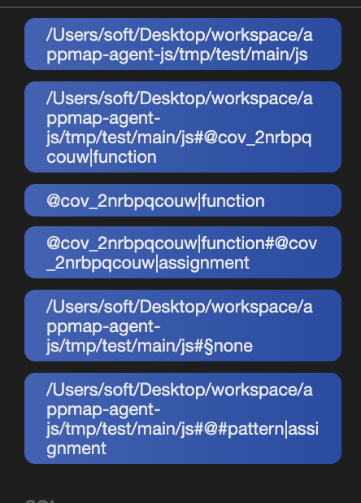
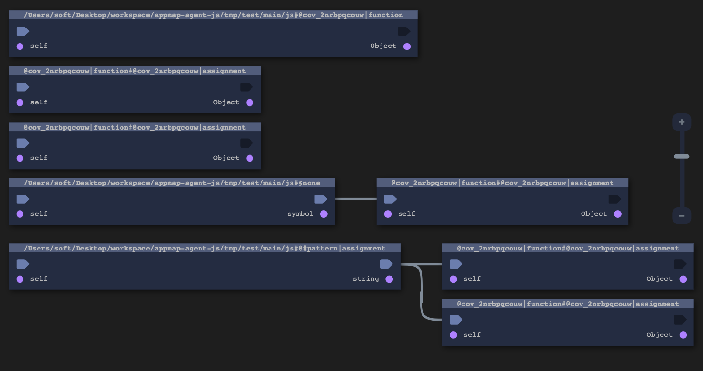

# Supporting test runner, a case study with node-tap

In this post, I attempt to explain how the `appmap-agent` supports test runners such as [tap](https://node-tap.org) out of the box.
It is also a good opportunity the showcase its inner workings.

## Setup

Lets assume we have the following file:

```js
// main.js
exports.foo = () => "foo";
((function f () {}) ());
```

```js
// test.js
const Tap = require('tap');
const Main = require("./main.js");
Tap.equal(Main.foo(), "foo");
```

```yml
# appmap.yml
output-dir: "."
enabled: true
packages: ["."]
```

And that we execute the command:

```sh
npx appmap-agent --no-hook-esm --rc-file ./appmap.yml -- npx tap ./test.js
```

## Log analysis

The agent is slightly modified to print the following events:
* `initialize`: a new child process make itself known to the server
* `instrument`: a child process requires the server to instrument a file
* `emit`: a child process log an event to the server
* `terminate`: a child process indicates the server it is about the exit

The entire log is [here](log.txt).
After analyzing the log we discover that four node child processes have been spawned.

1. `npx`

The first node process being spawned is `npx` which is a command utility to fetch locally installed npm modules.
The environment contains three appmap-related variables which indicate how the spawned process should communicate with the server.
It also contains the `NODE_OPTIONS` environment variable which is expected to hold CLI arguments for the `node` executable.
We use this environment variable to preload our hook.

```
initialize >> argv = [
  '/usr/local/bin/node',
  '/usr/local/bin/npx',
  'tap',
  '--nyc-arg',
  '--reporter=html',
  'tmp/test/test.js'
] env = {
  ...
  APPMAP_PROTOCOL: 'messaging',
  APPMAP_HOST: 'localhost',
  APPMAP_PORT: '61443',
  NODE_OPTIONS: '--require /Users/soft/Desktop/workspace/appmap-agent-js/lib/client/es2015/node14x/index-cjs.js'
}
instrument >> path = /usr/local/lib/node_modules/npm/bin/npx-cli.js
...
instrument >> path = /usr/local/lib/node_modules/npm/lib/workspaces/get-workspaces.js
```

Files from `npx` are intercepted for instrumentation but none of them are actually modified because they do not fit the package whitelist which is the current working directory.

2. `tap`

Next, `npx` executes the entry point script provided by `tap`.
We know about this child process because `npx` forwarded all the environment variables.

```
initialize >> argv = [
  '/usr/local/bin/node',
  '/Users/soft/Desktop/workspace/appmap-agent-js/node_modules/.bin/tap',
  '--nyc-arg',
  '--reporter=html',
  'tmp/test/test.js'
] env = {
  ...
  APPMAP_PROTOCOL: 'messaging',
  APPMAP_HOST: 'localhost',
  APPMAP_PORT: '61443',
  NODE_OPTIONS: '--require /Users/soft/Desktop/workspace/appmap-agent-js/lib/client/es2015/node14x/
}
instrument >> path = /Users/soft/Desktop/workspace/appmap-agent-js/node_modules/tap/bin/run.js
...
instrument >> path = /Users/soft/Desktop/workspace/appmap-agent-js/node_modules/nyc/lib/register-env.js
```

Files from `tap` are being intercepted (but not modified).

3. `istanbul`

Then, `tap` spawns itself with a hook for [istanbul](https://istanbul.js.org) which is a popular code coverage tool for node.
This is visible through the `NODE_OPTIONS` environment variable which now includes the `node-preload` entry point script.

```
initialize >> argv = [
  '/usr/local/bin/node',
  '/Users/soft/Desktop/workspace/appmap-agent-js/node_modules/.bin/tap',
  '--nyc-arg',
  '--reporter=html',
  'tmp/test/test.js'
] env = {
  ...
  APPMAP_PROTOCOL: 'messaging',
  APPMAP_HOST: 'localhost',
  APPMAP_PORT: '61443',
  NODE_OPTIONS: '--require /Users/soft/Desktop/workspace/appmap-agent-js/lib/client/es2015/node14x/index-cjs.js --require /Users/soft/Desktop/workspace/appmap-agent-js/node_modules/node-preload/preload-path/node-preload.js',
}
instrument >> path = /Users/soft/Desktop/workspace/appmap-agent-js/node_modules/node-preload/preload-path/node-preload.js
...
instrument >> path = /Users/soft/Desktop/workspace/appmap-agent-js/node_modules/tap/node_modules/treport/lib/reports/base/summary.js
```

Files from both `istanbul` and `tap` are being intercepted (but not modified).

4. `test`

Finally, the test is spawned by the `istanbul`-hooked `tap` process.

```
initialize >> argv = [
  '/usr/local/bin/node',
  '/Users/soft/Desktop/workspace/appmap-agent-js/tmp/test/test.js'
] env = {
  ...
  APPMAP_PROTOCOL: 'messaging',
  APPMAP_HOST: 'localhost',
  APPMAP_PORT: '61443',
  NODE_OPTIONS: '--require /Users/soft/Desktop/workspace/appmap-agent-js/lib/client/es2015/node14x/index-cjs.js --require /Users/soft/Desktop/workspace/appmap-agent-js/node_modules/node-preload/preload-path/node-preload.js'
}
instrument >> path = /Users/soft/Desktop/workspace/appmap-agent-js/node_modules/node-preload/preload-path/node-preload.js
...
instrument >> path = /Users/soft/Desktop/workspace/appmap-agent-js/tmp/test/main.js
```

Files from `istanbul` are being intercepted without modification.
Only the last import to `./main.js` is actually being modified.

### Appmap analysis

Because no file is actually modified within the three first processes, their respective appmaps are empty: [npz](npz.appmap.json), [tap](tap.appmap.json), and [tap-nyc](tap-nyc.appmap.json).
Only the last appmap is not empty: [test-main](test-main.appmap.json).
Interestingly, it is much more complex than or very simply `./main.js` file.




This is due to the fact that our hook is being inserted before the hook of istanbul (as `--require` modules are loaded in the order in which the appear as CLI argument).
Hence, the received file contents have already been instrumented by istanbul.
While it should be possible to inverse the order in which hooks are inserted, I'm not sure it makes more sense because istanbul will show code coverage for appmap-instrumented code.
Anyway, I thought it was worth sharing how this two code instrumentation tools interact with each others.
